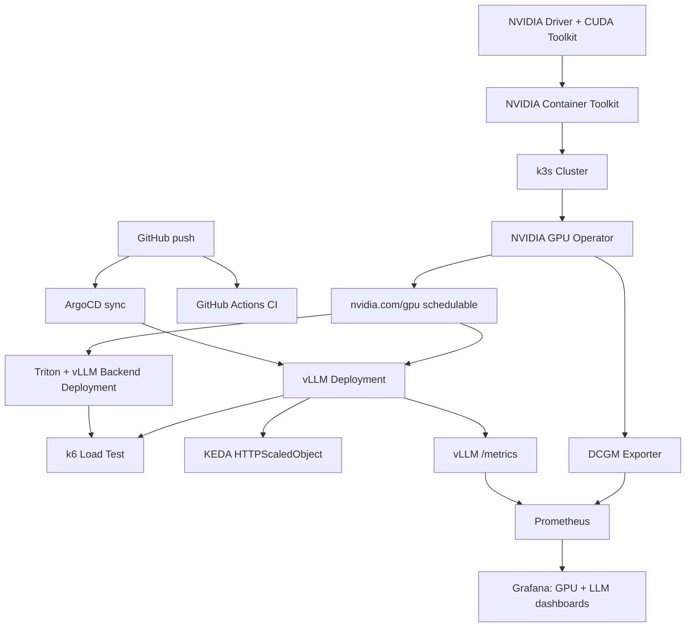

# GPU AI Platform — Provisioning to Observability

A hands-on build of a GPU-backed LLM inference platform on Kubernetes — from bare-metal NVIDIA driver installation through containerized serving, load testing, autoscaling, observability, CI/CD, GitOps, and LoRA fine-tuning. Built on a single Lambda Labs A10 (24GB) instance, using self-managed k3s (not a managed control plane), to force direct engagement with every layer a managed service like EKS would normally hide.

## What this demonstrates

- **GPU infrastructure from the hardware up**: NVIDIA driver, CUDA toolkit, NVIDIA Container Toolkit, and the exact compatibility rules that govern them
- **Kubernetes GPU scheduling**: self-managed k3s + NVIDIA GPU Operator, `nvidia.com/gpu` as a real schedulable resource
- **Two production serving stacks, containerized and Kubernetes-deployed**: vLLM (standalone) and Triton Inference Server (vLLM backend)
- **A real, honest load-test benchmark** comparing them (k6), including a disclosed anomaly
- **HTTP-triggered autoscaling** (KEDA) — core scale-from-zero mechanism verified working
- **A working Prometheus + Grafana observability stack** — two dashboards: GPU hardware metrics (via DCGM) and LLM application metrics (via vLLM's own `/metrics`), both built from real, debugged data pipelines
- **CI** (GitHub Actions: Kubernetes manifest validation + Dockerfile linting) and **GitOps** (ArgoCD) — core sync mechanism verified working
- **LoRA fine-tuning** of Qwen2.5-3B-Instruct with full MLflow experiment tracking (params, metrics, artifacts) and real before/after generation proof

## Architecture

## Stack

| Layer | Tool |
|---|---|
| GPU driver | NVIDIA 595.91.07 (open kernel module, Ampere) |
| Container runtime | Docker + NVIDIA Container Toolkit |
| Orchestration | k3s (self-managed, single-node) |
| GPU scheduling | NVIDIA GPU Operator (device plugin, DCGM exporter, GFD) |
| Serving | vLLM (standalone) and Triton Inference Server (vLLM backend) |
| Autoscaling | KEDA + HTTP add-on (scale-to-zero) |
| Load testing | k6 |
| Observability | Prometheus + Grafana (kube-prometheus-stack) |
| CI/CD | GitHub Actions (kubeconform, hadolint) |
| GitOps | ArgoCD |
| Fine-tuning | LoRA (peft), 4-bit quantized base (bitsandbytes), tracked in MLflow |

## Results — Serving Benchmark

10 concurrent users, 60s sustained load, Qwen2.5-3B-Instruct, single A10:

| Metric | vLLM (standalone) | Triton + vLLM backend |
|---|---|---|
| Throughput | 11.35 req/s | 6.33 req/s |
| p50 latency | 741ms | 1.46s |
| p95 latency | 1.27s | 2.25s |
| Failure rate | 0% | 0% |

vLLM standalone delivered ~1.8x the throughput of Triton+vLLM. Since Triton's backend calls into the same underlying vLLM engine, this isolates Triton's serving-layer overhead (HTTP routing, a separate Python backend process) rather than reflecting a difference in inference engines — Triton's value (multi-model hosting, built-in Prometheus metrics, protocol standardization) isn't exercised by a single-model test like this one.

## Results — LoRA Fine-Tuning

Trained a LoRA adapter (rank 8, `q_proj`/`v_proj`) on Qwen2.5-3B-Instruct to adopt a structured `[SUMMARY]/[DETAIL]` response format, using a 200-example synthetic dataset. Only **0.06% of the model's 3B parameters** were trained (1.84M of 3.09B). Training completed in 64 seconds on the A10, with a clean, steadily decreasing loss curve (3.81 → 1.09 over 2 epochs).

**Verified real behavior change, not just loss going down:** tested on "explain how volcanoes erupt" — a topic never in the 20-topic training set. The base model answered normally; the fine-tuned model correctly applied the trained `[SUMMARY]/[DETAIL]` format while keeping the underlying explanation coherent — real evidence of generalization, not memorization, and of LoRA's "no catastrophic forgetting" property (the frozen base model's knowledge stayed intact).

Full experiment (hyperparameters, loss metric, and the trained adapter artifact) tracked in MLflow.

## Real problems solved (not a clean-room build)

This project surfaced 17 distinct infrastructure incidents, each diagnosed with direct evidence rather than guesswork — CUDA toolkit scope errors, a version-mismatched JIT-compiled kernel, orphaned GPU processes causing self-sustaining Kubernetes crash-loops (in two different applications), a stale `kubectl apply` that silently didn't roll a new pod, a Prometheus `ServiceMonitor` failure eventually root-caused to a missing label directly on a Service object (found by reading Prometheus's actual generated scrape config), and an MLflow tracking failure root-caused to a missing explicit tracking URI and then fully fixed and reverified. 15 of 17 incidents were fully resolved; 2 remain genuinely open and documented rather than hidden (see below).

## Honest limitations (documented, not hidden)

- **KEDA HTTP scale-to-zero**: the scale-up mechanism is confirmed working (a Deployment at 0 replicas correctly scales to 1 on incoming HTTP traffic, verified independently twice). The interceptor's client-facing timeout during cold start remains misconfigured after two targeted fix attempts; the production fix would replace the blocking-wait pattern with a fallback/retry response rather than tuning the timeout further.
- **ArgoCD automatic polling**: the core sync mechanism is confirmed working (a change in Git genuinely propagates to the live cluster, verified independently via `kubectl`). Automatic, unattended polling was specifically tested across 5 real cycles over 12+ minutes and did not reliably detect real changes without a manual `--hard-refresh`; root cause narrowed to a caching/comparison issue in the application controller, not fully identified.
- **GPU memory capacity**: a single 24GB A10 cannot run two ~3B-parameter model servers simultaneously at the memory settings used here — benchmarking was done sequentially by design, documented rather than worked around by shrinking KV-cache size (which would have skewed the comparison).

## Cost

Built and operated on Lambda Labs on-demand A10 (~$0.75/hr), no reserved capacity or spot pricing. Lambda Cloud has no stop/start — only terminate — so cost governance here means aggressive session-based teardown rather than idle-shutdown automation; a real constraint worth naming rather than glossing over.

## What's not built (yet)

Quantization comparison (post-training). A next step, not an oversight — the infrastructure to support it is already in place.

## Repo contents

- `vllm/` — Dockerfile and Kubernetes Deployment/Service manifests for vLLM standalone
- `triton/` — Kubernetes Deployment/Service manifest and model repository config for Triton + vLLM backend
- `load-test/` — k6 load test scripts (vLLM and Triton), plus the KEDA `HTTPScaledObject` config
- `observability/` — Prometheus `ServiceMonitor` for the DCGM GPU-metrics exporter
- `.github/workflows/` — CI pipeline (Kubernetes manifest validation, Dockerfile linting)
- `docs/` — session documentation (benchmark report, cost report)
